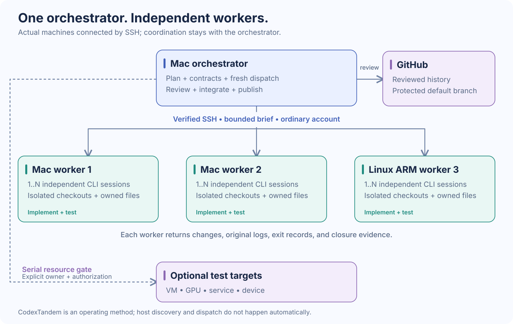
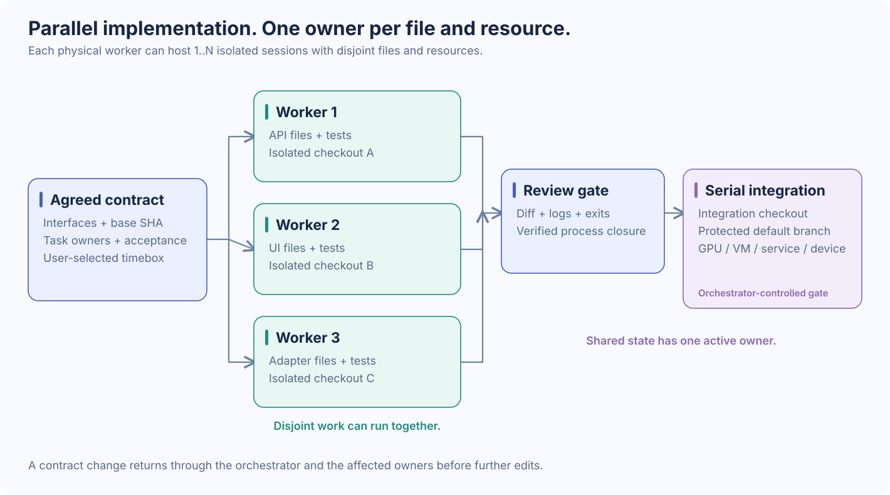

# Diagrams

The SVGs are readable previews for Markdown and sharing. The matching Mermaid files are editable source. They describe this operating method rather than an automatically provisioned cluster.

## Host topology

[Editable Mermaid source](diagrams/topology.mmd)

The orchestrator has direct SSH access to each ordinary worker account. Each worker runs independent Codex CLI sessions in isolated checkouts. GitHub stores reviewed project history. Optional VM, GPU, service, and device targets are separate resources with an explicit owner and authorization.

## Task lifecycle

[Editable Mermaid source](diagrams/workflow.mmd)

The important gate is between a returned result and integration: inspect the original exits and logs, verify the diff or bundle, and prove the exact task process group is closed. Long waits use ordinary tooling; another useful worker session begins with a fresh brief.

## Ownership and shared resources

[Editable Mermaid source](diagrams/ownership.mmd)

Different workers can implement independently against one agreed contract. Shared integration state and runtime resources remain serialized. Physical hosts, concurrent sessions, and shared resource slots are different planning dimensions.

## Editing

Edit `.mmd` for Mermaid renderers, or edit the SVG directly with a vector editor or text editor. Keep labels consistent with [Workflow](WORKFLOW.md). The SVG files use native vector shapes and text, have no script or external asset dependencies, and can be opened directly in a browser.
