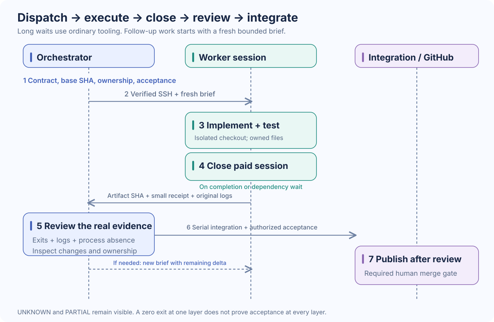

# Workflow

The orchestrator keeps one durable plan and a small task ledger. Workers get only what they need to implement and test a bounded task. Start new sessions for follow-ups with fresh briefs; do not carry retired session history into new work.



## 1. Plan the contract and ownership

Before dispatch, define the desired behavior, interfaces, base commit, file owners, shared resource owners, and acceptance checks. Identify which work is independent and which needs a producer's result. Give every shared GPU, service, device, VM, deployment, or integration checkout one active owner.

Independent tasks may run in parallel across physical machines. Multiple sessions on one machine require isolated workspaces and disjoint files and resources. Do not count an idle session waiting on a dependency as productive capacity.

Use a compact ledger:

| Task | Host | Base | Owned files / resources | Dependency | State | Submission |
| --- | --- | --- | --- | --- | --- | --- |
| API | Worker 1 | Commit SHA | API module and tests | Contract v1 | READY | Pending |
| UI | Worker 2 | Same SHA | UI module and tests | Contract v1; mock API | READY | Pending |
| Adapter | Worker 3 | Same SHA | Adapter module and tests | Hardware test gate | READY | Pending |

Useful states are `READY`, `RUNNING`, `WAITING`, `RETURNED`, `REVIEWED`, `INTEGRATED`, and `BLOCKED`. Store the relevant facts and artifact references; avoid a second hierarchy of tracking documents.

## 2. Write the fresh worker brief

```text
Task: <single concrete outcome>
Project and checkout: <isolated path>
Base commit: <full SHA>
Requested model / reasoning: <exact user selection; locally verified CLI id>
Contract: <relevant API/schema/UI behavior and compatibility requirements>
You own: <explicit files and any exclusive resource>
Other owners: <files/interfaces you must not edit>
Allowed actions: <implementation, tests, branch/commit policy>
Limits: <user-selected timebox; no live-target action without its gate>
Acceptance: <meaningful commands and expected behavior>
Return: <diff or bundle/branch SHA, concise summary, original log references,
         test outcomes, native/wrapper/outer exits, process closure evidence>
If blocked: <finish useful independent work, close the session, report the need>
```

A follow-up includes the relevant contract, accepted work, review findings, and the exact remaining delta. Link original evidence when needed. Do not paste the full previous transcript, retired instructions, or nested historical receipt chains.

## 3. Dispatch one bounded CLI session

Run on the verified worker account in its isolated checkout. Resolve the selected model identifier and reasoning value before filling in this example. The paths and variables are placeholders, not a supplied launcher.

```sh
# Run on the worker with an already prepared brief and log directory.
# These variables must be set to locally verified values before invocation.
codex exec \
  --cd "$task_checkout" \
  --model "$task_model_id" \
  -c "model_reasoning_effort=\"$task_reasoning\"" \
  --sandbox workspace-write \
  --json \
  --output-last-message "$task_log_dir/final.md" \
  - < "$task_brief" \
  > "$task_log_dir/events.jsonl" \
  2> "$task_log_dir/stderr.log"
task_native_exit=$?
# Record task_native_exit before running another command.
```

`codex exec` supports stdin prompts, JSONL output, and a final-message file; see [official OpenAI non-interactive documentation](https://learn.chatgpt.com/docs/non-interactive-mode). Recheck `codex exec --help` on each host because flags and supported configuration can change.

Preserve the original output streams. If you use a wrapper, record its own status separately and have it preserve the native CLI status. If SSH or another outer launcher is involved, capture that original status too. A connection failure can hide the remote result; it must not become a fabricated success code. Avoid pipelines that discard the native exit status.

The example keeps model-generated writes inside the checkout. Tests or builds that need an external task-owned directory require an explicit `--add-dir <task-owned-path>` grant; add only the necessary path. Capturing CLI output in an external log directory does not make unrelated directories writable by the agent.

For long-running dispatch, use your environment's approved process supervision and record the exact session's process and group identity. This guide does not prescribe a cross-platform launcher. Do not detach a process without a reliable way to collect its completion and stop its exact group safely.

## 4. Close on completion or wait

When a worker finishes its useful work, collect the output and let its paid session exit. During a long download, model load, or producer dependency, perform necessary waiting or monitoring with ordinary tooling and close the paid worker session. Dispatch a fresh brief when the dependency is ready.

If cancellation is required, identify the exact task process group using its host, host boot identity, PID, PID birth time, and recorded descendants. Stop only that verified task; do not use broad process-name kills. Check for native CLI, wrapper, and child processes afterwards. A PID can be reused, and the same PID on another host has no connection to the first task.

Closure is not established by a final assistant message, an expired timeout, a missing terminal tab, or a wrapper's `success` field alone. Verify the native process and intended task group are absent on the original host and boot. If that check cannot be completed, label closure `UNKNOWN` and keep the workspace or resource from reassignment.

## 5. Return a proportional receipt

Use one small receipt per task and references to original logs. A receipt should contain:

| Field | Required detail |
| --- | --- |
| Identity | Task, worker alias, host identity, boot identity, session/process group and PID birth |
| Inputs | Base commit, brief digest, exact model and reasoning selection |
| Changes | Owned files, branch/head SHA or diff/bundle SHA-256 |
| Checks | Command, exit, outcome, and original log path for each meaningful check |
| Completion | Original native CLI exit, wrapper exit if used, outer launch/SSH exit |
| Closure | Observation time and verified absence of the task's processes/group |
| Limits | Failed, partial, unknown, skipped, or untested checks and remaining work |

Keep full transcripts in logs rather than copying them into the receipt. Hashes bind a receipt to its brief or artifact; they do not prove correctness, authorization, or physical testing. Do not nest giant base64 artifacts or signed historical chains in new briefs or reports.

## 6. Review before integration

The orchestrator checks the original logs, all applicable exit statuses, process closure, base and submitted SHAs, and the actual diff. Confirm ownership, inspect failure and cancellation paths, and judge whether the tests substantiate the claimed behavior. A zero CLI exit is one piece of evidence, not acceptance of the implementation.

Reproduce meaningful checks in the integration environment where appropriate. Synthetic tests prove their fixture behavior; hosted execution, physical device behavior, lifecycle cleanup, and UI acceptance each need their own evidence. Keep `UNKNOWN`, `PARTIAL`, and `NOT_TESTED` visible. Never upgrade them to passed because another layer succeeded.

If fixes are needed, send a fresh brief containing the relevant review findings and remaining delta. Do not resume a retired worker session. An active worker that still owns a bounded task may receive steering before closure; once closed, use a new session for new work.

## 7. Integrate, test, and publish

Integrate reviewed submissions serially in the orchestrator's checkout. Resolve interface conflicts with the relevant owner. Run checks appropriate to the combined change, then perform authorized runtime, UI, device, or deployment acceptance through the shared resource gate.

Workers may push their explicitly assigned work branches when their task permits it. The orchestrator owns PRs, default-branch integration, release publication, and deployment, after the required review and project authorization. Root credentials alone do not enforce that boundary; use repository protection and the intended human merge gate, as explained in [Access](ACCESS.md).

The user chooses the timebox. Protect a rehearsal window and remove optional scope before it. A deadline does not turn incomplete evidence into acceptance. Keep the orchestrator chat working until the agreed outcome is handled or the user explicitly changes the plan; do not introduce an automatic three-hour handoff.

## Recovery without replay

If connectivity drops, inspect the original worker and its logs before deciding whether the task finished, is still running, or has an unknown outcome. Do not start a duplicate task or repeat a live action while its outcome is uncertain. Capture the remaining uncertainty, preserve the artifacts, and recover only the exact authorized session or resource.

At project retirement, close and verify workers, release shared resource ownership, record unresolved evidence, and revoke or remove access as authorized. A new project starts with a fresh contract and fresh authorization; retired approvals and session histories are not its bootstrap.
